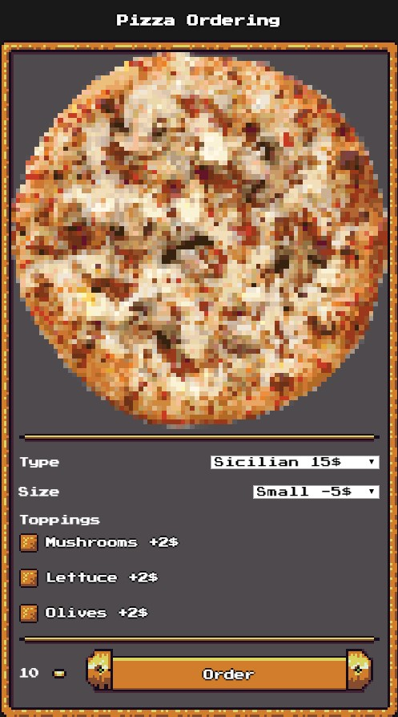

# Pizza Orderer

> An app in retro style using [vue](https://github.com/vuejs/vue), [vuex](https://github.com/vuejs/vuex) and [rpgui](https://github.com/RonenNess/RPGUI)

> [Live](https://cubbk.github.io/pizza-retro/)



## Build Setup

``` bash
# install dependencies
npm install

# serve with hot reload at localhost:8080
npm run dev
```


